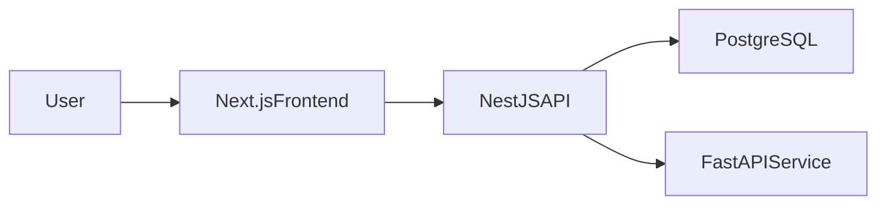

# Student Management MVP

Modernized portfolio project that evolves a legacy static app into a full-stack Student Management System with:
- Next.js frontend dashboard
- NestJS backend API (JWT + RBAC + Students + Courses + Enrollments + Grades + Analytics)
- FastAPI AI risk prediction service (light ML)
- PostgreSQL persistence via Prisma (compatible with hosted Supabase Postgres)

## Architecture

## Tech Stack
- Frontend: Next.js App Router, TypeScript, Tailwind, Recharts
- Backend: NestJS, Prisma, PostgreSQL, JWT auth
- AI Service: FastAPI, scikit-learn Logistic Regression
- Infra: Docker Compose

## Project Layout
- `frontend/`: dashboard UI
- `backend/`: API and business logic
- `ai-service/`: ML inference service
- `infra/`: local docker stack
- `archive/legacy-static-app/`: original HTML/CSS/JS app

## Database: Supabase or local Postgres

Prisma expects two URLs in **`backend/.env`** (copy from [`backend/.env.example`](backend/.env.example)):

| Variable | Purpose |
|----------|---------|
| `DATABASE_URL` | **Runtime** NestJS + Prisma. On Supabase, use the **transaction pooler** URI (often port **6543** with `?pgbouncer=true` as given in [Supabase docs](https://supabase.com/docs/guides/database/connecting-to-postgres#connection-pooler)). |
| `DIRECT_URL` | **Migrations** (`prisma migrate`). Use the **direct** Postgres connection (port **5432** from Project Settings → Database). For local Docker Postgres without a pooler, set `DIRECT_URL` **identical** to `DATABASE_URL`. |

If `DATABASE_URL` is missing, Prisma fails with **`P1012`**. Always create `backend/.env` before running `prisma migrate`.

## Quick Start (Local)
1. Copy env templates:
   - `backend/.env.example` -> `backend/.env` and fill `DATABASE_URL` / `DIRECT_URL` (see above)
   - `frontend/.env.example` -> `frontend/.env`
2. Start PostgreSQL and AI service (skip if using Supabase cloud only):
   - `docker compose -f infra/docker-compose.yml up postgres ai-service -d`
3. Backend setup:
   - `cd backend`
   - `npm install`
   - `npm run prisma:generate`
   - `npm run prisma:migrate` (applies SQL in `prisma/migrations/`; use a fresh DB or `prisma migrate reset` if you still have the old `StudentGrade`-only schema)
   - `npm run seed`
   - `npm run start:dev`
4. Frontend:
   - `cd frontend`
   - `npm install`
   - `npm run dev`
5. Open `http://localhost:3000`

## Demo Credentials
- Admin: `admin@sms.local`
- Teacher: `teacher@sms.local`
- Student: `student@sms.local`
- Password (all): `Password123!`

## API Highlights
- `POST /auth/login`
- `POST /auth/register`
- `GET /students`
- `POST /students`
- `GET /courses`, `POST /courses`, `GET /courses/:id`
- `GET /enrollments`, `POST /enrollments`
- `POST /grades`, `GET /grades/student/:id`
- `GET /analytics/student/:id`

After login, open **`/courses`** in the Next.js app for course, enrollment, and grade workflows.

## Validation and Tests
- Backend unit tests: `npm run test -w backend`
- Frontend smoke test (running app required): `npm run test:smoke -w frontend`
- Type checks: `npm run lint -w backend`

## Troubleshooting

- **Frontend looks like bare HTML / black background:** Tailwind needs [`frontend/tailwind.config.ts`](frontend/tailwind.config.ts) with a `content` array that includes your `./src/**/*` files; without it, utility classes used in JSX are not generated (only globals like dark `prefers-color-scheme` may apply).
- **Prisma migrate cannot connect:** Confirm Postgres is reachable (local Docker running, or correct Supabase host), and **`DIRECT_URL`** uses a non-pooled connection for migrations.

## Roadmap
Follow-up modules are documented in `docs/roadmap.md` and architecture notes are in `docs/architecture.md`.
