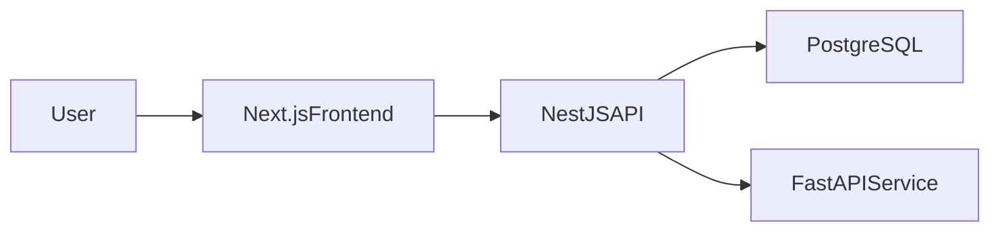

# Student Management MVP

Modernized portfolio project that evolves a legacy static app into a full-stack Student Management System with:
- Next.js frontend dashboard
- NestJS backend API (JWT + RBAC + Students + Analytics)
- FastAPI AI risk prediction service (light ML)
- PostgreSQL persistence via Prisma

## Architecture

## Tech Stack
- Frontend: Next.js App Router, TypeScript, Tailwind, Recharts
- Backend: NestJS, Prisma, PostgreSQL, JWT auth
- AI Service: FastAPI, scikit-learn Logistic Regression
- Infra: Docker Compose

## Project Layout
- `frontend/`: dashboard UI
- `backend/`: API and business logic
- `ai-service/`: ML inference service
- `infra/`: local docker stack
- `archive/legacy-static-app/`: original HTML/CSS/JS app

## Quick Start (Local)
1. Copy env templates:
   - `backend/.env.example` -> `backend/.env`
   - `frontend/.env.example` -> `frontend/.env`
2. Start PostgreSQL and AI service:
   - `docker compose -f infra/docker-compose.yml up postgres ai-service -d`
3. Backend setup:
   - `cd backend`
   - `npm install`
   - `npm run prisma:generate`
   - `npm run prisma:migrate`
   - `npm run seed`
   - `npm run start:dev`
4. Frontend:
   - `cd frontend`
   - `npm install`
   - `npm run dev`
5. Open `http://localhost:3000`

## Demo Credentials
- Admin: `admin@sms.local`
- Student: `student@sms.local`
- Password: `Password123!`

## API Highlights
- `POST /auth/login`
- `POST /auth/register`
- `GET /students`
- `POST /students`
- `GET /analytics/student/:id`

## Validation and Tests
- Backend unit tests: `npm run test -w backend`
- Frontend smoke test (running app required): `npm run test:smoke -w frontend`
- Type checks: `npm run lint -w backend`

## Roadmap
Follow-up modules are documented in `docs/roadmap.md` and architecture notes are in `docs/architecture.md`.
